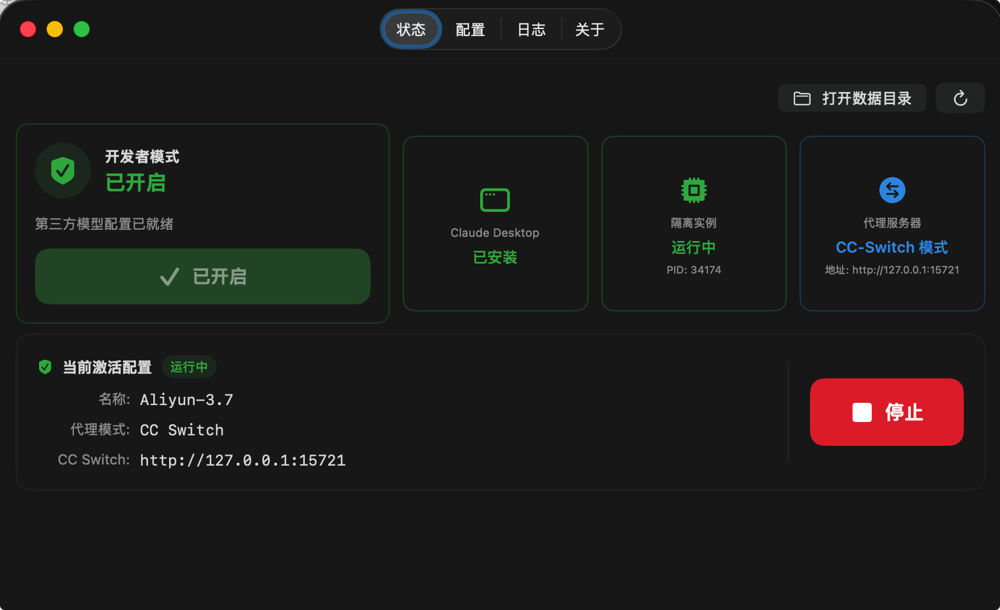
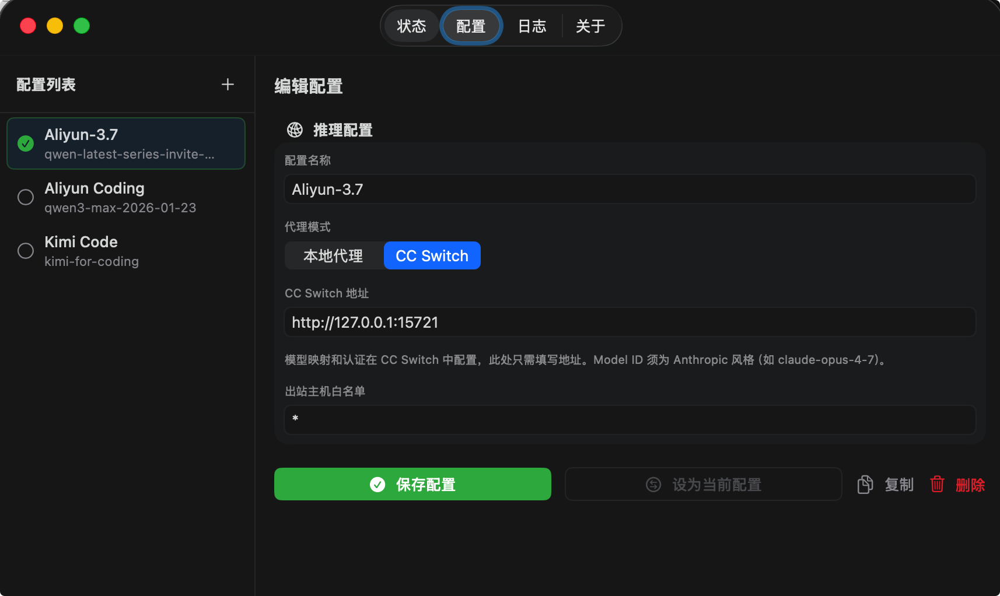
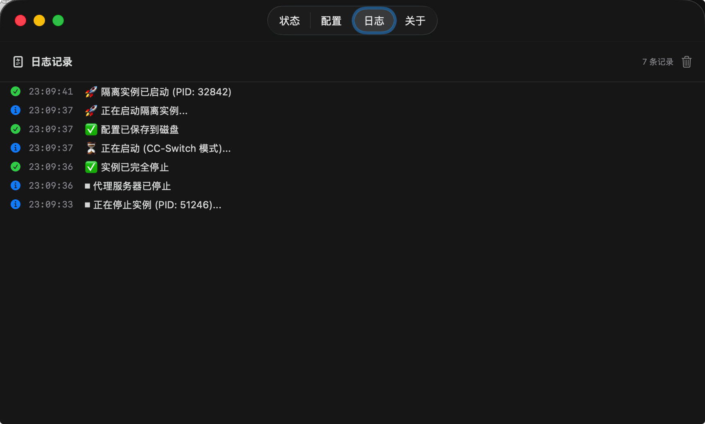

# ClaudeDual - Claude Desktop Third-Party Model Manager

[English](README.md) · [简体中文](README_zh.md)

ClaudeDual is a macOS desktop application designed for Claude Desktop users to manage third-party model configurations and enable Developer Mode. Through isolated instance launching and built-in proxy server, you can easily integrate various third-party model providers.

## 📸 Screenshots

| Status | Configuration | Logs |
|:---:|:---:|:---:|
|  |  |  |

## 🚀 Features

### 🔄 Isolated Instance Management
- **Independent Running**: Launch completely isolated instances from main Claude Desktop via `--user-data-dir` parameter
- **Status Monitoring**: Real-time display of instance running status, PID and more
- **One-Click Control**: Convenient start/stop control with graceful termination

### ⚙️ Multi-Configuration Management
- **Configuration System**: Create, edit, copy, delete multiple model configurations
- **Flexible Switching**: Quick switching between different model providers and settings
- **Parameter Customization**: Fully configurable API address, keys, authentication methods, model names, etc.

### 🌐 Proxy Server
- **Built-in Proxy**: Integrated Python HTTP proxy supporting request forwarding and model name mapping
- **Authentication Conversion**: Supports multiple authentication methods: Bearer, x-api-key, anthropic-api-key
- **Port Adaptation**: Automatically detects port conflicts, dynamically allocates available ports

### 🔄 CC-Switch Mode (New)
- **Seamless Integration**: Direct integration with [CC-Switch](https://github.com/musistudio/ccswitch) local gateway service
- **Independent Configuration**: Uses CC-Switch's built-in model mapping and authentication configuration
- **Mode Switching**: Freely switch between CC-Switch mode and local proxy mode

### 💡 User Experience
- **Intuitive Interface**: Modern SwiftUI interface with real-time status cards
- **Developer Mode**: One-click enable Claude Desktop Developer Mode
- **Log Tracking**: Detailed operation logs and status information

## 🏗️ Core Principles

### Isolated Instance Launch
```bash
open -n -a /Applications/Claude.app --args --user-data-dir=~/Library/Application\ Support/ClaudeDual-3p
```

- Run Claude Desktop in an independent data directory, completely isolated from the main app
- Avoids configuration conflicts, allows running multiple Claude instances simultaneously

### Configuration Injection Mechanism
The app generates and writes configuration files to the isolated instance's `configLibrary/` directory before launching:

**Inference Configuration** (`7595758f-...json`):
```json
{
  "coworkEgressAllowedHosts": ["*"],
  "inferenceProvider": "gateway",
  "inferenceGatewayBaseUrl": "http://127.0.0.1:3456/",
  "inferenceGatewayApiKey": "claude-dual-local-proxy",
  "inferenceGatewayAuthScheme": "bearer",
  "inferenceModels": [
    "claude-sonnet-4-6",
    "claude-opus-4-7",
    "claude-haiku-4-5"
  ]
}
```

### Proxy Server Workflow
1. **Request Reception**: Proxy server listens on specified port (default 3456)
2. **Model Mapping**: Converts Claude frontend model names to upstream actual model names
3. **Authentication Processing**: Adds appropriate authentication headers based on configuration
4. **Request Forwarding**: Forwards processed requests to upstream API
5. **Response Return**: Streams upstream response back to Claude

### CC-Switch Integration
When CC-Switch mode is enabled:
- Bypass local proxy, directly point gateway address to CC-Switch service
- No need to duplicate model mapping and authentication in ClaudeDual
- Leverage CC-Switch's advanced routing and load balancing features

## 🔧 Installation & Usage

### System Requirements
- macOS 13.0 or higher
- Claude Desktop installed

### Installation Steps
1. Download the latest released DMG file
2. Drag to Applications folder
3. First run requires allowing in privacy settings

If macOS blocks the app with "unverified developer", run:

```bash
sudo xattr -r -d com.apple.quarantine /Applications/ClaudeDual.app
```

### Build from Source

ClaudeDual is a single-file SwiftUI app — no Xcode project required.

```bash
# Compile a standalone executable
swiftc -parse-as-library ClaudeDualApp.swift -o ClaudeDual

# Or package a full .app bundle (icon + proxy script + Info.plist)
tools/PackageApp.sh
```

Requires macOS 13.0+, Swift toolchain (Xcode Command Line Tools), and Python 3 for the built-in proxy.

### Basic Usage Flow
1. **Check Status**: Confirm Claude Desktop is installed and Developer Mode is enabled
2. **Create Configuration**: Add your third-party model provider settings in configuration page
3. **Select Mode**:
   - Local Proxy Mode: ClaudeDual manages all configurations
   - CC-Switch Mode: Connect to existing CC-Switch service
4. **Start Instance**: Click start button, wait for isolated instance to load
5. **Start Using**: Experience third-party models in the new instance

## 📋 Supported Model Providers

- **DashScope** (Qwen series)
- **Bailian** (Bailian Platform)
- **Kimi** (Moonshot AI)
- **Lingyi Wanwu** (yi series)
- **Zhipu AI** (glm series)
- **And any other OpenAI-compatible API services**

## ⚡ Advanced Features

### Outbound Host Whitelist
Customize `coworkEgressAllowedHosts` to control external domains accessible to Claude.

### Custom Model Mapping
Through the proxy server, map Claude frontend displayed model names to actual upstream model names.

### CC-Switch Delegation
Use CC-Switch as the upstream gateway when you want model routing, authentication, and load balancing to be managed outside ClaudeDual.

## 🛡️ Security Notice

- API keys are stored locally only, not uploaded to any server
- Isolated instances ensure third-party model configurations don't affect main app
- All network requests are processed locally, protecting user data privacy

## 📚 Documentation

- [第三方模型配置指南](docs/第三方模型配置指南.md) — Full guide to Developer Mode and third-party inference (Chinese)
- [安装说明](docs/安装说明.md) — Installation notes (Chinese)

## 🤝 Contributing

Welcome to submit Issues and Pull Requests to improve ClaudeDual!

## 📄 License

[MIT License](LICENSE)

---

*ClaudeDual lets you easily experience various third-party models in the Claude ecosystem and enjoy the fun of AI development!*
