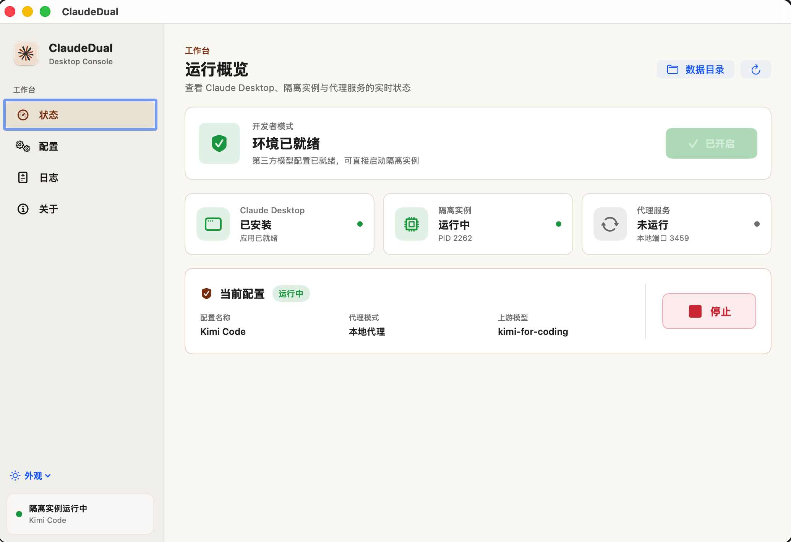
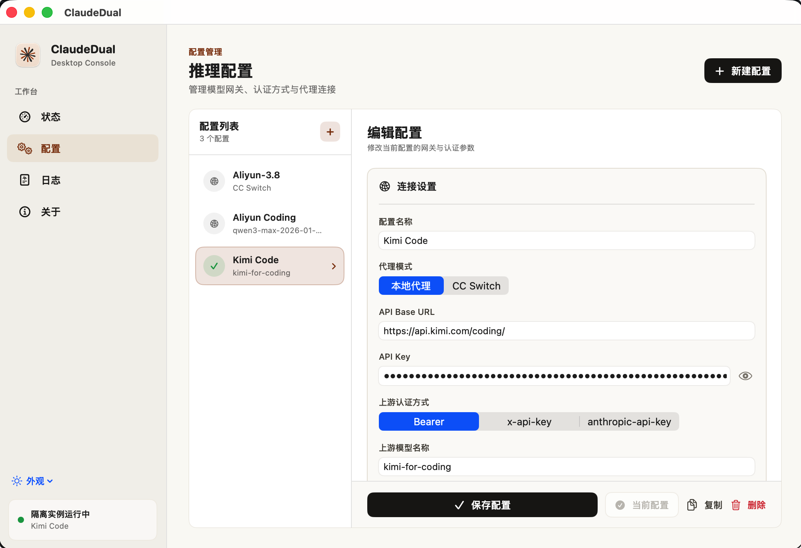
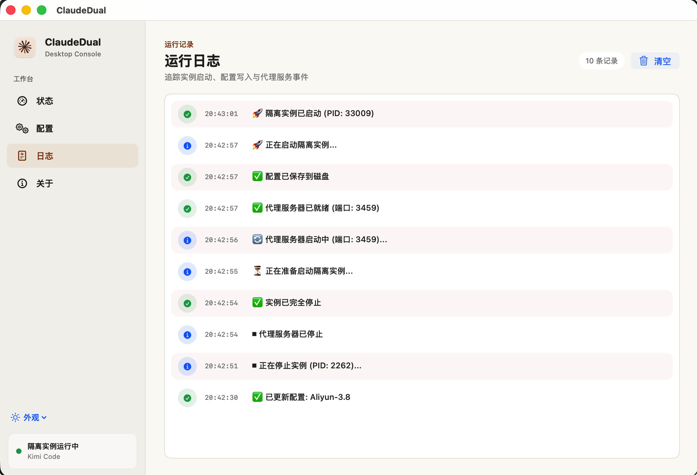

# ClaudexDual - Claude 与 Codex 第三方模型管理器

[English](README.md) · [简体中文](README_zh.md)

ClaudexDual（原 ClaudeDual）是一款 macOS 桌面应用，用于管理 Claude Desktop 与 Codex 的第三方推理配置、隔离实例和本地代理。两种客户端共享配置列表，可分别设置 API 地址和模型映射。Claude 支持一键开启开发者模式。

产品已更名为 **ClaudexDual**。为保留现有配置、密钥和在线升级兼容性，GitHub 仓库地址及内部 `ClaudeDual` 数据标识保持不变。从旧版 ClaudeDual 手动升级时，请安装 ClaudexDual.app，确认可用后删除旧的 ClaudeDual.app；无需删除用户数据。

## 📸 界面预览



| 配置 | 日志 |
|:---:|:---:|
|  |  |

## 🚀 功能特性

### 🔄 隔离实例管理
- **独立运行**：通过 `--user-data-dir` 参数从主 Claude Desktop 启动完全隔离的实例
- **Codex 隔离**：使用独立的 `CODEX_HOME` 和桌面数据目录，保留现有 Codex 配置
- **状态监控**：实时显示实例运行状态、PID 等信息
- **一键控制**：便捷的启动/停止控制，支持优雅终止

### ⚙️ 多配置管理
- **配置系统**：创建、编辑、复制、删除多套模型配置
- **灵活切换**：在不同模型服务商和设置之间快速切换
- **参数自定义**：API 地址、密钥、认证方式、模型名称等完全可配置

### 🌐 代理服务器
- **内置代理**：集成 Python HTTP 代理，支持请求转发和模型名称映射
- **认证转换**：支持多种认证方式：Bearer、x-api-key、anthropic-api-key
- **端口自适应**：自动检测端口冲突，动态分配可用端口

### 🔄 CC-Switch 模式
- **无缝集成**：直接对接 [CC-Switch](https://github.com/musistudio/ccswitch) 本地网关服务
- **独立配置**：复用 CC-Switch 内置的模型映射和认证配置
- **模式切换**：在 CC-Switch 模式和本地代理模式之间自由切换

### 💡 使用体验
- **直观界面**：现代化 SwiftUI 界面，实时状态卡片
- **开发者模式**：一键开启 Claude Desktop 开发者模式
- **日志追踪**：详细的操作日志和状态信息

## 🏗️ 核心原理

### 隔离实例启动
```bash
open -n -a /Applications/Claude.app --args --user-data-dir=~/Library/Application\ Support/ClaudeDual-3p
```

- 在独立的数据目录中运行 Claude Desktop，与主应用完全隔离
- 避免配置冲突，允许同时运行多个 Claude 实例

### 配置注入机制
应用在启动前会生成配置文件并写入隔离实例的 `configLibrary/` 目录：

配置页分别填写 **Claude API Base URL（Anthropic）** 和 **Codex API Base URL（OpenAI）**。Claude 请求 `/v1/messages`，Codex 请求 `/v1/responses`；如果服务商为两个协议提供不同地址，不能把 OpenAI 兼容地址填到 Claude 一栏。例如阿里云 Model Studio 应使用 `.../apps/anthropic` 和 `.../v1`（Token Plan 的 OpenAI 地址为 `.../compatible-mode/v1`）。

**推理配置**（`7595758f-...json`）：
```json
{
  "coworkEgressAllowedHosts": ["*"],
  "inferenceProvider": "gateway",
  "inferenceGatewayBaseUrl": "http://127.0.0.1:3456/",
  "inferenceGatewayApiKey": "claude-dual-local-proxy",
  "inferenceGatewayAuthScheme": "bearer",
  "inferenceModels": [
    "claude-fable-5",
    "claude-opus-5",
    "claude-sonnet-5",
    "claude-haiku-4-5-20251001"
  ]
}
```

### 代理服务器工作流程
1. **接收请求**：代理服务器监听指定端口（默认 3456）
2. **模型映射**：将 Claude 前端模型名转换为上游真实模型名
3. **认证处理**：根据配置添加对应的认证头
4. **请求转发**：将处理后的请求转发到上游 API
5. **响应返回**：将上游响应流式回传给 Claude

### CC-Switch 集成
启用 CC-Switch 模式时：
- 跳过本地代理，将 gateway 地址直接指向 CC-Switch 服务
- 无需在 ClaudexDual 中重复配置模型映射和认证
- 复用 CC-Switch 的高级路由和负载均衡能力

## 🔧 安装与使用

### 系统要求
- macOS 13.0 或更高版本
- 已安装需要使用的 Claude Desktop 或 Codex
- 内置代理需要 Python 3

### 安装步骤
1. 下载[最新发布的 DMG 文件](https://github.com/saibogoo/ClaudeDual/releases/latest)
2. 拖入「应用程序」文件夹
3. 首次运行需在隐私设置中允许

如果 macOS 提示「无法验证开发者」，可执行：

```bash
sudo xattr -r -d com.apple.quarantine /Applications/ClaudexDual.app
```

### 在线升级

ClaudexDual 启动后会自动检查 GitHub Release，也可以在“关于 → 在线升级”中手动检查。发现新版本后：

1. 点击“下载并安装”
2. 应用会核对 Release 资产大小和 GitHub 提供的 SHA-256 摘要
3. 校验通过后自动替换应用并重新启动，无需手动拖拽

如果自动安装无法进行（例如安装目录不可写），应用会恢复原有版本并打开 DMG，供你手动安装。

### 从源码构建

ClaudexDual 是单文件 SwiftUI 应用，无需 Xcode 工程。

```bash
# 编译为独立可执行文件
swiftc -parse-as-library ClaudexDualApp.swift -o ClaudexDual

# 或打包完整的 .app（图标 + 代理脚本 + Info.plist）
tools/PackageApp.sh
```

需要 macOS 13.0+、Swift 工具链（Xcode 命令行工具），以及用于内置代理的 Python 3。

### 基本使用流程
1. **检查状态**：选择 Claude 或 Codex，确认对应客户端已安装；使用 Claude 时开启开发者模式
2. **创建配置**：在配置页添加你的第三方模型服务商设置
3. **选择模式**：
   - 本地代理模式：由 ClaudexDual 管理所有配置
   - CC-Switch 模式：对接已有的 CC-Switch 服务
4. **启动实例**：点击启动按钮，等待隔离实例加载
5. **开始使用**：在新实例中体验第三方模型

## 📋 上游协议要求

Claude 需要兼容 Anthropic Messages（`/v1/messages`）的服务，Codex 需要兼容 OpenAI Responses（`/v1/responses`）的服务。仅支持 Chat Completions 的 OpenAI 兼容接口并不保证可用；本地代理负责映射和认证，不转换这两种协议。

## 模型映射（v1.3.2）

- Claude：分别设置 Sonnet、Opus、Fable、Haiku 的显示别名和实际请求模型；Subagent 设置未匹配模型的默认目标。
- 可声明百万上下文模型；实际可用上下文仍取决于上游服务和客户端支持。
- Codex：独立设置本地模型 ID 和实际请求模型。客户端菜单可能仍显示 `Custom`，映射改变的是实际请求。
- 从服务端获取模型列表，一键使用列表中的首个模型填入当前客户端的映射。
- 浏览配置不会主动读取钥匙串，编辑时密钥留空会保留已保存密钥。

## ⚡ 进阶功能

### 出站主机白名单
自定义 `coworkEgressAllowedHosts`，控制 Claude 可访问的外部域名。

### 自定义模型映射
通过代理服务器，将 Claude 前端显示的模型名映射到上游真实模型名。

### CC-Switch 委托
当你希望模型路由、认证和负载均衡在 ClaudexDual 之外统一管理时，可将 CC-Switch 作为上游网关。

## 🛡️ 安全说明

- API 密钥保存在 macOS Keychain，发送请求时用于向所配置的上游服务认证
- 隔离实例确保第三方模型配置不影响主应用
- 本地代理会把请求内容转发给你配置的上游服务；请按该服务的数据政策使用

## 📚 文档

- [第三方模型配置指南](docs/第三方模型配置指南.md) —— Developer Mode 与第三方推理完整指南
- [Codex 隔离实例](docs/Codex隔离实例.md) —— 共享推理配置，隔离第二个 Codex 的状态与桌面数据
- [安装说明](docs/安装说明.md) —— 安装与常见问题
- [发布流程规范](docs/发布流程规范.md) —— 打包发布流程与版本号规则

> Codex 使用 OpenAI Responses API（`/v1/responses`）。如果配置的是仅支持 Anthropic Messages API 的上游地址，Codex 会收到 404；请改用 OpenAI Responses 兼容的地址或网关。

## 🤝 贡献

欢迎提交 Issue 和 Pull Request 来改进 ClaudexDual！

## 📄 许可证

[MIT License](LICENSE)

---

*ClaudexDual 让你在 Claude 与 Codex 中轻松体验各种第三方模型，享受 AI 开发的乐趣！*
